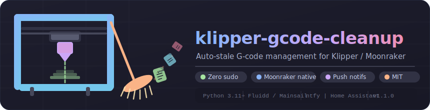

<div align="center">



<br/>

[](https://github.com/saikhurana98/klipper-gcode-cleanup/actions/workflows/ci.yml)
[](https://www.python.org/)
[](https://www.klipper3d.org/)
[](https://moonraker.readthedocs.io/)
[](LICENSE)

**Automatically sweeps stale G-code files off your Klipper printer.**  
Files go to a trash folder first — so you have a recovery window — then vanish for good.  
All thresholds and the schedule are editable live from the **Fluidd / Mainsail config editor**.

</div>

---

## ✨ Features

- 🗓️ **Scheduled cleanup** — runs on the 1st of every month; trash permanently deleted on the 7th
- 🛡️ **Smart retention** — never deletes files uploaded or printed within the last 7 days (configurable)
- 📁 **Subdirectory aware** — walks nested folders and removes empty ones after cleanup
- 🔔 **Push notifications** — real browser / phone alerts via [ntfy](https://ntfy.sh); Home Assistant ready
- 🔄 **Moonraker update manager** — appears in Fluidd / Mainsail update panel, one-click updates
- 🔒 **Zero sudo** — runs entirely as the `pi` user; no system files touched
- ⚡ **Hot config** — change schedule or retention in the web editor; takes effect on the next hourly tick
- 🖨️ **Print-safe** — aborts automatically if the printer is actively printing

---

## 🚀 Quick start

```bash
# 1. Clone into your home directory on the printer
git clone https://github.com/saikhurana98/klipper-gcode-cleanup.git ~/klipper-gcode-cleanup

# 2. Install (no sudo needed)
bash ~/klipper-gcode-cleanup/install.sh
```

The installer:
- Copies the default config to `~/printer_data/config/gcode_cleanup.cfg`
- Registers a **systemd user timer** that fires every hour (`~/.config/systemd/user/`)
- Enables session linger so the timer survives without an active SSH session

---

## 🔄 Moonraker update manager

Add this block to `~/printer_data/config/moonraker.conf` to enable **one-click updates** from Fluidd / Mainsail:

```ini
[update_manager klipper-gcode-cleanup]
type: git_repo
path: ~/klipper-gcode-cleanup
origin: https://github.com/saikhurana98/klipper-gcode-cleanup.git
primary_branch: main
install_script: install.sh
```

Then restart Moonraker:

```bash
curl -s -X POST http://localhost:7125/server/restart
```

The addon will appear in the **Update Manager** panel alongside Klipper and Fluidd.

---

## ⚙️ Configuration

Edit `gcode_cleanup.cfg` directly from **Fluidd → Config files** or **Mainsail → Machine → Config files**.  
All changes take effect on the **next hourly tick** — no restart needed.

```ini
[gcode_cleanup]

# ── Schedule ────────────────────────────────────────────────────────────────
cleanup_day: 1          # Day of month to move stale files to trash  (1–28)
purge_day: 7            # Day of month to permanently delete trash    (1–28)
run_hour: 5             # Hour to run in local time (0–23)  →  05:00 IST

# ── Retention ────────────────────────────────────────────────────────────────
min_upload_age_days: 7  # Keep files uploaded within this many days
min_since_print_days: 7 # Keep files printed within this many days

# ── Notifications: ntfy  ─────────────────────────────────────────────────────
ntfy_enabled: false
ntfy_url: https://ntfy.sh          # or your self-hosted instance
ntfy_topic:                        # e.g. klipper-workshop-abc123

# ── Notifications: Fluidd / Mainsail console  (secondary fallback) ───────────
fluidd_notifications: true

# ── Notifications: Home Assistant  ──────────────────────────────────────────
homeassistant_enabled: false
homeassistant_url: http://homeassistant.local:8123
homeassistant_token:
homeassistant_notify_service: notify.notify
```

### Full config reference

| Key | Default | Description |
|---|---|---|
| `cleanup_day` | `1` | Day of month to move files to trash |
| `purge_day` | `7` | Day of month to permanently delete trash |
| `run_hour` | `5` | Hour of day to run (local Pi timezone) |
| `min_upload_age_days` | `7` | Grace period for recently uploaded files |
| `min_since_print_days` | `7` | Grace period for recently printed files |
| `ntfy_enabled` | `false` | Enable ntfy push notifications |
| `ntfy_url` | `https://ntfy.sh` | ntfy server URL |
| `ntfy_topic` | _(none)_ | Your unique ntfy topic |
| `fluidd_notifications` | `true` | Send summary to Fluidd/Mainsail console |
| `homeassistant_enabled` | `false` | Enable Home Assistant notifications |
| `homeassistant_url` | _(none)_ | HA base URL |
| `homeassistant_token` | _(none)_ | HA long-lived access token |
| `homeassistant_notify_service` | `notify.notify` | HA service to call |

---

## 🔔 Push notifications with ntfy

[ntfy](https://ntfy.sh) delivers real **browser pop-ups and phone push notifications** — no account required.

```
1. Pick a unique topic name (treat it like a password):
   e.g.  klipper-workshop-xk7q2

2. Subscribe in your browser:
   https://ntfy.sh/klipper-workshop-xk7q2

3. Or install the ntfy app (Android / iOS) and subscribe to the same topic.

4. Enable in gcode_cleanup.cfg:
   ntfy_enabled: true
   ntfy_topic: klipper-workshop-xk7q2
```

You can also self-host ntfy for full privacy — just point `ntfy_url` at your instance.

---

## 🕐 How scheduling works

A **systemd user timer** fires every hour. The script reads `gcode_cleanup.cfg` and exits immediately if the current day/hour don't match the schedule. This means:

```
Every hour at :00 → script starts → checks config
  ├─ Wrong hour?          exit (< 1 second)
  ├─ Right hour, day == cleanup_day  →  run cleanup
  ├─ Right hour, day == purge_day   →  run purge
  └─ Right hour, neither day?       exit
```

A file is **kept** (never moved) if *either* of the following holds:

| Check | Condition |
|---|---|
| 📅 Recently uploaded | `now − file_mtime < min_upload_age_days` |
| 🖨 Recently printed | `now − last_print_start < min_since_print_days` |

Last print time is sourced from **Moonraker's job history API** — no file metadata parsing required.

---

## 🛠 Manual usage

```bash
# Dry run — logs every decision, changes nothing
python3 ~/klipper-gcode-cleanup/cleanup.py --cleanup --dry-run
python3 ~/klipper-gcode-cleanup/cleanup.py --purge   --dry-run

# Force a real run (ignores today's date)
python3 ~/klipper-gcode-cleanup/cleanup.py --cleanup
python3 ~/klipper-gcode-cleanup/cleanup.py --purge

# Use a custom config path
python3 ~/klipper-gcode-cleanup/cleanup.py --cleanup --config /path/to/gcode_cleanup.cfg
```

---

## 📋 Logs

```bash
# Live log tail
tail -f ~/printer_data/logs/gcode-cleanup.log

# System journal (Raspberry Pi)
journalctl --user -t klipper-cleanup -f

# All runs from this month
journalctl --user -t klipper-cleanup --since "$(date +%Y-%m-01)"

# Check timer schedule
systemctl --user list-timers klipper-cleanup.timer
```

---

## 🗑️ Uninstall

```bash
# Disable the timer
systemctl --user disable --now klipper-cleanup.timer

# Remove unit files
rm ~/.config/systemd/user/klipper-cleanup.{service,timer}
systemctl --user daemon-reload

# Remove config (optional — keep it if you plan to reinstall)
rm ~/printer_data/config/gcode_cleanup.cfg

# Remove the repo
rm -rf ~/klipper-gcode-cleanup
```

---

## 🤝 Contributing

PRs must pass the CI pipeline (ruff lint + 38 pytest tests) before merging to `main`.

```bash
# Run locally before pushing
pip install ruff pytest requests
ruff check . && ruff format --check .
pytest tests/ -v
```

---

<div align="center">

Made with ☕ for the Klipper community · [Report an issue](https://github.com/saikhurana98/klipper-gcode-cleanup/issues)

</div>
